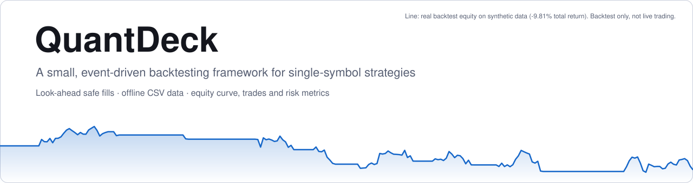
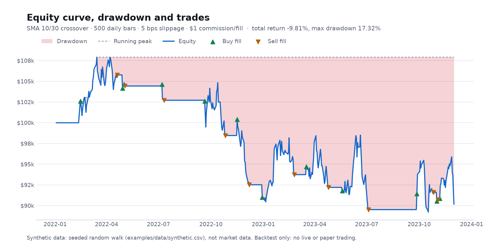
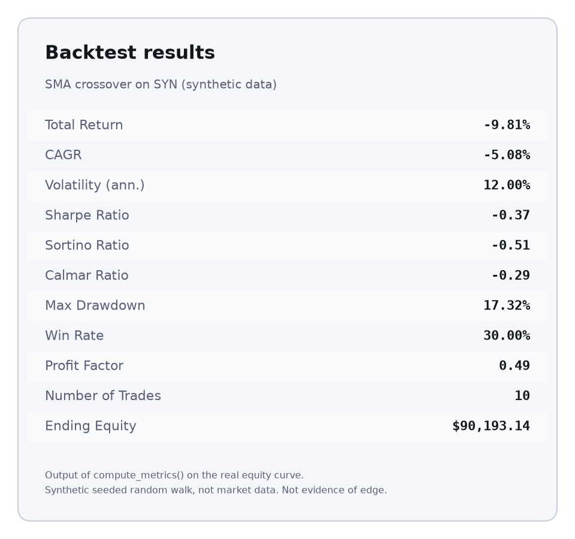
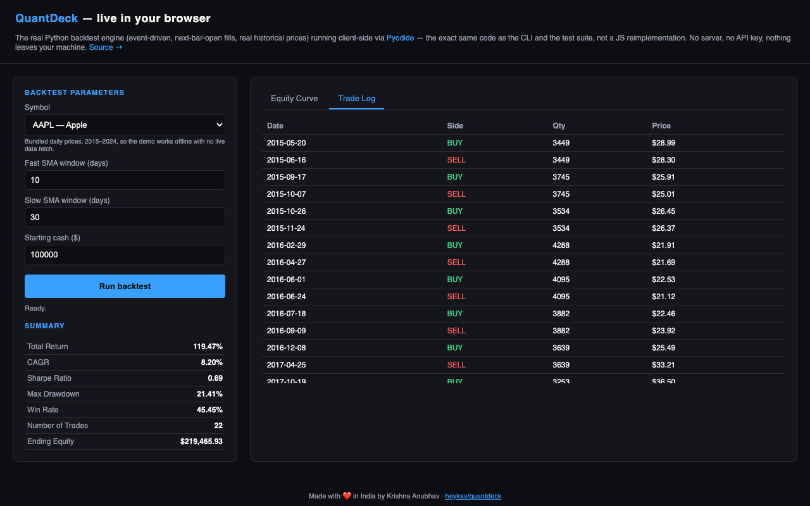
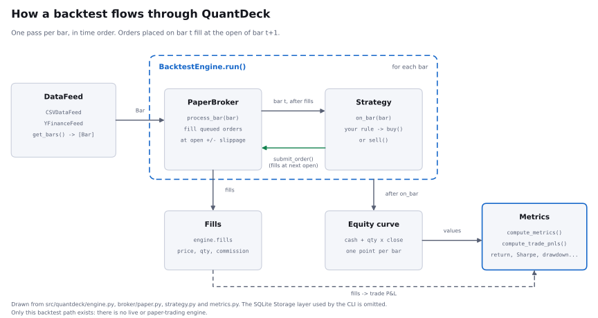

# QuantDeck

<picture>
  <source media="(prefers-color-scheme: dark)" srcset="docs/img/banner-dark.svg">
  <source media="(prefers-color-scheme: light)" srcset="docs/img/banner-light.svg">
  
</picture>

A small, event-driven backtesting framework for single-symbol trading strategies. Write a `Strategy` class, replay it over OHLCV bars, get an equity curve, trade list and risk metrics. It runs offline on CSV files and needs no database server.

<p>
  <a href="https://heykav.github.io/quantdeck/"></a>
  &nbsp;&nbsp;
  <a href="LICENSE"></a>
</p>

## Quickstart (offline, about a minute)

```bash
git clone https://github.com/heykav/quantdeck.git && cd quantdeck
python3 -m venv .venv && source .venv/bin/activate
pip install .

quantdeck backtest examples/sma_crossover.py --symbol SYN \
    --start 2022-01-01 --end 2030-01-01 --csv examples/data/synthetic.csv
```

Expected output (deterministic; verified from a clean virtualenv):

```
Running backtest: SmaCrossoverStrategy on SYN (2022-01-01 → 2030-01-01)
         Backtest Results
┏━━━━━━━━━━━━━━━━━━━┳━━━━━━━━━━━━┓
┃ Metric            ┃      Value ┃
┡━━━━━━━━━━━━━━━━━━━╇━━━━━━━━━━━━┩
│ Total Return      │     -9.79% │
│ CAGR              │     -5.07% │
│ Volatility (ann.) │     12.00% │
│ Sharpe Ratio      │      -0.37 │
│ Sortino Ratio     │      -0.51 │
│ Calmar Ratio      │      -0.29 │
│ Max Drawdown      │     17.31% │
│ Win Rate          │     30.00% │
│ Profit Factor     │       0.49 │
│ Number of Trades  │         10 │
│ Ending Equity     │ $90,214.14 │
└───────────────────┴────────────┘
```

`examples/data/synthetic.csv` is a **seeded random walk, not market data**, so those numbers only show that the pipeline runs. To use Yahoo Finance data instead (needs network access), drop `--csv`: `quantdeck backtest examples/sma_crossover.py --symbol AAPL --start 2023-01-01 --end 2023-12-31`.

The same run from Python: `python examples/offline_backtest.py`. See the [tutorial](manual/tutorial.md) and the [API reference](manual/api.md).

### What a run looks like

These figures are generated by [`scripts/make_figures.py`](scripts/make_figures.py) from one real run of `python examples/offline_backtest.py` on the same synthetic series. **The data is a seeded random walk, not market data**, so the results say nothing about real performance. That script uses a $1 commission per fill, so its total return is -9.81% versus -9.79% in the commission-free CLI table above.

<picture>
  <source media="(prefers-color-scheme: dark)" srcset="docs/img/equity-dark.png">
  <source media="(prefers-color-scheme: light)" srcset="docs/img/equity-light.png">
  
</picture>

<picture>
  <source media="(prefers-color-scheme: dark)" srcset="docs/img/metrics-dark.png">
  <source media="(prefers-color-scheme: light)" srcset="docs/img/metrics-light.png">
  
</picture>

## What this is / is not

**Is:**
- A backtester for one symbol at a time, with market orders only.
- Look-ahead safe by construction: `on_bar(bar)` sees bar `t`; orders fill at the open of bar `t+1` plus slippage.
- Deterministic and unit-tested, including hand-computed P&L and metrics cross-checked against numpy/pandas.

**Is not:**
- **Not a live or paper-trading system.** No live engine or broker integration exists in this repository. `Strategy` only talks to a small engine interface, so a live engine could be written, but that has not been done or tested. Alpaca support is a roadmap idea, not a feature.
- Not a portfolio, multi-asset, limit/stop-order or intraday-microstructure simulator. There is no partial fill, market impact, borrow cost, margin, dividend or split handling beyond what the data feed provides (`YFinanceFeed` uses split/dividend-adjusted prices).
- Not evidence that a strategy will make money. Backtests overfit easily; results on synthetic data mean nothing. Not financial advice.

Behaviours worth knowing: a buy you cannot afford at the fill price is rejected (see `engine.rejected_orders`); sells beyond your position are rejected unless `allow_short=True`; orders placed on the last bar never fill; commission is a flat amount per fill.

## Live demo

**[heykav.github.io/quantdeck](https://heykav.github.io/quantdeck/)** — pick a symbol and SMA windows, click "Run backtest," and watch the real engine run in your browser (no install, no server, nothing sent anywhere). Every trade is logged too:



The demo uses a handful of bundled historical datasets (2015–2024) so it works instantly with no live network fetch — the same `BacktestEngine`, `Strategy`, and metrics code as the CLI, just fed pre-downloaded prices instead of a live `yfinance` call.

---

## What is this, actually?

**Algorithmic trading** just means: instead of a person watching a stock chart and clicking "buy" or "sell" by hand, you write a small program with rules — like *"buy 10 shares of Apple if its price rises above its 10-day average"* — and let the computer follow those rules.

Before you'd ever trust such a program with real (or even fake) money, you want to know: *if I had run this rule over the last year of real stock prices, would I have made money or lost it?* That process — replaying your rule against historical prices to see how it would have performed — is called **backtesting**. That's what QuantDeck does.

Concretely, QuantDeck gives you three things:

1. **A simple way to write a "strategy"**: a small Python class with your buy/sell rule.
2. **A backtesting engine** that plays your strategy over historical bars one at a time, tracking cash, positions and equity.
3. **A results report**: return, risk metrics and a trade list, saved to SQLite.

Offline CSV data needs no account or API key. Yahoo Finance data is optional and needs network access.

---

## Prerequisites

You only need one thing installed: **Python 3.10 or newer**.

To check what you have, open a terminal and run:

```bash
python3 --version
```

- If it says `Python 3.10.x`, `3.11.x`, or `3.12.x` (or newer) — you're good, skip to [Installation](#installation).
- If it says something older (like `3.9.x`) or you get a "command not found" error, install a current Python first:
  - **Mac**: `brew install python@3.12` (install [Homebrew](https://brew.sh) first if you don't have it), or download from [python.org](https://www.python.org/downloads/).
  - **Windows**: download the installer from [python.org](https://www.python.org/downloads/) and make sure to check "Add Python to PATH" during setup.
  - **Linux**: use your package manager, e.g. `sudo apt install python3.12`.

You'll also want [git](https://git-scm.com/downloads) installed to download this project (most Macs and Linux machines already have it).

---

## Installation

Open a terminal and run these commands one at a time:

```bash
# 1. Download the project
git clone https://github.com/heykav/quantdeck.git
cd quantdeck

# 2. Create an isolated Python environment just for this project
#    (this keeps QuantDeck's dependencies separate from everything else on your machine)
python3 -m venv .venv

# 3. Activate that environment
#    On Mac/Linux:
source .venv/bin/activate
#    On Windows (Command Prompt):
#    .venv\Scripts\activate.bat

# 4. Install QuantDeck and its dependencies
pip install -e ".[dev]"
```

You'll know it worked if running `quantdeck --help` prints a list of commands instead of an error.

> **Note:** every time you open a *new* terminal window to work on this project, you'll need to run step 3 (`source .venv/bin/activate`) again first — that's what tells your terminal "use QuantDeck's Python environment."

---

## Your first backtest

QuantDeck ships with a ready-made example strategy at [`examples/sma_crossover.py`](examples/sma_crossover.py). Try it right now:

```bash
quantdeck backtest examples/sma_crossover.py --symbol AAPL --start 2023-01-01 --end 2023-12-31
```

Here's what each part of that command means:

| Part | Meaning |
|---|---|
| `backtest` | the CLI command that runs a backtest |
| `examples/sma_crossover.py` | the file containing the strategy to test |
| `--symbol AAPL` | the stock ticker to test against — Apple, in this case |
| `--start 2023-01-01` | the first day of historical data to include |
| `--end 2023-12-31` | the last day of historical data to include |

Behind the scenes, QuantDeck fetches AAPL's real daily prices for 2023 from Yahoo Finance (no account or API key needed), replays the strategy's rules day-by-day, and prints a results table. It takes a few seconds.

---

## Understanding the results

Running a backtest prints the table shown in the [Quickstart](#quickstart-offline-about-a-minute). What each row means:

| Metric | What it tells you |
|---|---|
| **Total Return** | How much your money grew (or shrank) over the whole period, as a percentage. |
| **CAGR** | "Compound Annual Growth Rate" — the return re-stated as *"if this rate continued for a full year, every year"*. Useful for comparing strategies tested over different time spans. |
| **Sharpe Ratio** | A measure of return *relative to how bumpy the ride was*. Roughly: above 1 is decent, above 2 is very good, below 0 means you'd have been better off not trading. It rewards steady gains and penalizes wild swings. |
| **Max Drawdown** | The single worst drop from a peak to a low point during the test, as a percentage. `17%` means at some point your account fell 17% below its previous high. This is a key measure of "how bad could it get." |
| **Win Rate** | Of all the completed trades (a buy followed by a matching sell), what percentage made money. `30%` means 3 out of 10 trades were profitable. Trade P&L is net of commission. |
| **Number of Trades** | How many completed round-trip trades the strategy made. |
| **Ending Equity** | The final dollar value of the account, starting from $100,000 by default. |

Results are also saved to a local file, `quantdeck.db`, so you can keep a history of every backtest you've run (a SQLite database — just a single file, no server needed; you can even open it with a free tool like [DB Browser for SQLite](https://sqlitebrowser.org/) if you want to poke around).

---

## Writing your own strategy

A strategy is just a Python class. Generate a starter template:

```bash
quantdeck init my_strategy.py
```

This creates:

```python
"""A starter QuantDeck strategy — edit this to build your own."""
from quantdeck.strategy import Strategy


class MyStrategy(Strategy):
    def on_bar(self, bar):
        # Example: buy 10 shares if we have no position yet.
        if self.position == 0:
            self.buy(10)
```

A few things to know:

- **`on_bar(self, bar)`** is called once for every day (or "bar") of historical data, in order. This is the only method you *must* implement — it's where your trading logic goes.
- **`bar`** is the current day's price data. It has `bar.open`, `bar.high`, `bar.low`, `bar.close`, `bar.volume`, and `bar.timestamp`.
- **`self.buy(qty)`** and **`self.sell(qty)`** place orders. Orders fill at the *next* bar's opening price (plus slippage) — never the price of the day you decided to trade, since in real life you can't buy at a price you've already seen close.
- **`self.position`** tells you how many shares you currently hold (0 if none).
- **`self.cash`** is how much uninvested cash you have; **`self.equity`** is your total account value (cash + the current value of anything you're holding).
- **`on_start(self)`** and **`on_end(self)`** are optional — override them to set up variables before the backtest begins, or to do something after it ends.

Once you've edited it, run it just like the example:

```bash
quantdeck backtest my_strategy.py --symbol AAPL --start 2023-01-01 --end 2023-12-31
```

Want a slightly more advanced example? Look at [`examples/sma_crossover.py`](examples/sma_crossover.py) — it tracks a rolling average of recent prices to decide when to buy and sell, with comments explaining each step.

---

## How it works under the hood

```
Strategy (your code)
    │  on_bar(bar) → buy()/sell()
    ▼
BacktestEngine  ──drives──▶  DataFeed (YFinanceFeed / CSVDataFeed)
    │
    ▼
PaperBroker (simulated fills, slippage, commission)
    │
    ▼
Storage (SQLite) + Metrics (return, CAGR, Sharpe, drawdown, win rate)
```

The same flow as a diagram, drawn from the code in `engine.py`, `broker/paper.py`, `strategy.py` and `metrics.py` (the SQLite step used by the CLI is left out):

<picture>
  <source media="(prefers-color-scheme: dark)" srcset="docs/img/architecture-dark.svg">
  <source media="(prefers-color-scheme: light)" srcset="docs/img/architecture-light.svg">
  
</picture>

In plain words: the **engine** is a loop that hands your strategy one day of prices at a time. Whenever your strategy calls `buy()` or `sell()`, the engine passes that order to a simulated **broker**, which fills it at a realistic price (accounting for typical trading costs) and updates your account. After every day, the engine records your total account value, building up an **equity curve** — and at the end, the **metrics** module turns that curve into the summary table you saw above.

Only this backtest path is implemented. `Strategy` calls a small engine surface (`submit_order`, `cash`, `position_qty`, `equity`), which a live engine could implement in future; no such engine exists today.

---

## Glossary

Terms you'll see throughout this project:

- **Bar** — one unit of price data (e.g., one day's open/high/low/close/volume). Metrics assume daily bars (252 periods/year).
- **Backtest** — simulating a strategy against historical data to see how it would have performed.
- **Paper trading** — trading with fake money against real, live prices (as opposed to a backtest, which uses past data). QuantDeck does not do this; its `PaperBroker` only simulates fills inside a backtest.
- **Slippage** — the small difference between the price you expected to pay and the price you actually got, which happens in real trading. QuantDeck simulates this so backtest results aren't unrealistically perfect.
- **Commission** — a fee charged per trade by a broker.
- **Look-ahead bias** — a common backtesting mistake where a strategy accidentally "sees the future" (e.g., trading at a price it couldn't have known yet). QuantDeck avoids this by filling orders at the *next* bar's price.
- **Equity curve** — a graph (or list) of your total account value over time.
- **OHLCV** — Open, High, Low, Close, Volume: the standard five numbers describing one bar of price data.

---

## CLI reference

| Command | What it does |
|---|---|
| `quantdeck init [path]` | Creates a starter strategy file (defaults to `strategy.py`). |
| `quantdeck backtest <file> --symbol <TICKER> --start <YYYY-MM-DD> --end <YYYY-MM-DD>` | Runs a backtest. Optional: `--csv <file>` (offline OHLCV data instead of Yahoo Finance), `--cash`, `--slippage-bps` (default 5), `--commission` (flat per fill), `--risk-free-rate`, `--db` (default `quantdeck.db`). |
| `quantdeck --help` | Lists all commands. |

---

## Troubleshooting

- **`command not found: quantdeck`** — you probably haven't activated the virtual environment in this terminal. Run `source .venv/bin/activate` (Mac/Linux) from inside the `quantdeck` folder.
- **`No data returned for '<SYMBOL>' between ...`** — check the ticker symbol is correct and that the date range includes trading days (e.g., not entirely a weekend or a date range in the future).
- **`No Strategy subclass found in <file>`** — your strategy file needs a class that inherits from `Strategy` (e.g., `class MyStrategy(Strategy):`).
- **Install fails with a Python version error** — re-check `python3 --version` is 3.10 or newer (see [Prerequisites](#prerequisites)), and make sure you created the virtual environment with that version.

---

## Development

```bash
pip install -e ".[dev]"
pytest                              # tests (offline, deterministic)
ruff check . && ruff format --check src tests examples scripts
mypy                                # strict type check
python scripts/gen_api_docs.py      # regenerate manual/api.md
python scripts/make_figures.py      # regenerate the images in docs/img/ (needs matplotlib, a dev extra)
```

---

## Roadmap

- [x] **Phase 1** — event-driven backtest engine, strategy interface, SQLite storage, metrics, CLI
- [ ] **Phase 2** — interactive Streamlit dashboard (equity curve, trade log, positions), not started
- [ ] **Phase 3** — idea only, not started: a live/paper-trading engine reusing `Strategy`

---

## Important disclaimer

QuantDeck is an educational and research tool. Backtested performance does **not** guarantee future results — real markets involve costs, risks, and behavior that a simulation can't fully capture. Nothing in this project is financial advice. If you ever move from backtesting to trading with real money, start with a broker's paper-trading (fake money) mode first, and only risk money you can afford to lose.

---

## License

MIT
